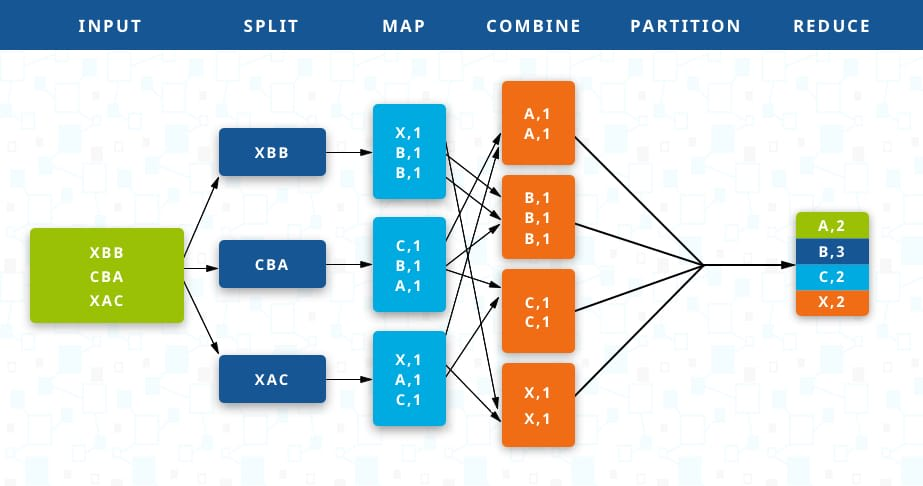
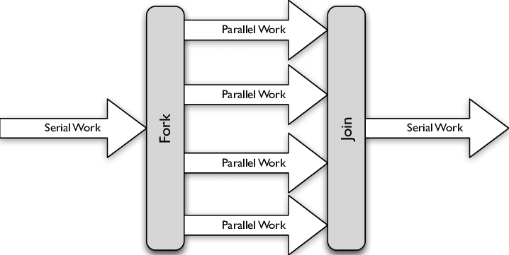
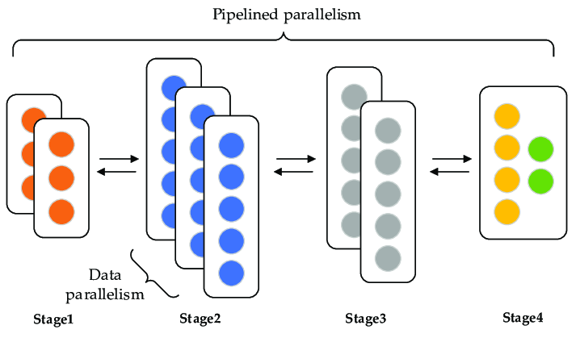

# Go 语言碎碎念：并发

## 免责声明
读者不会从这篇文章看到：  
1. Goroutine 的默认栈空间大小是多少，协程和线程有什么区别。  
2. 某 API 调用之异步与同步，阻塞与非阻塞。  
3. `select` 或 `runtime.gopark()` 的源码解析。  
4. Go 和 Java 比哪个快？  

## Go 的背景
Go 语言初创团队三剑客分别是：Ken Thompson, Rob Pike 和 Robert Griesemer。据 Ken Thompsen 所言，当初发明 Go 是因为 [KThom]：
> When the three of us got started, it was pure research. The three of us got together and decided that we hated C++.

10 年后，Go 语言增长的势头非常好——但 C++ 也是。Go 发布两年后，C++ 正式推出了 C++11 标准，并在此后规律地每三年出一个新版本，开发者数量再次回升。这部分工作不容小觑——C++ 标准从来没有被某个大公司把持过，C++ 也没有公司为其做商业推广。看看隔壁 Sun 如何对待 Java，C++ 标委会更像是用爱发电。

而 Rob Pike 作为知名嘴炮，多次在公开场合冷嘲热讽 C++ 的复杂 [Sys]，强调 Go 自有另一套注重简约的语言哲学。那他们是什么样的关系，为什么听着是竞争对手，但实际应用领域看着不搭边？这段话被我掏出来咀嚼了很多次，看了 Rob Pike 的一些表述和其他的一些资料，我隐约察觉到这句话有其语境，那就是解决 Google 的问题 [Go?]。

Google 的海量规模，会遇到前所未有的问题，也会遇到已知问题被放大到难以忍受的程度。对于前所未有的问题，Google 的那三篇最有名的分布式论文就是非常好的例子：Google File System, MapReduce 和 BigTable，有兴趣的同学可以自行去查阅。

举例几点已知的问题：  
1. C++ 的编译耗时，这是当初 Go 想解决的一大痛点。C++ 为了兼容 C 以提高易用度（他俩都诞生在 Bell Lab），包括其编译模型。  Google 内部的 C++ 代码量级本身相当可观，加上 Google 内部代码仓库的组织方式，再加上用 70 年代的 C 编译模型来编译，属于凌迟。  
2. 语言本身的复杂度，C++ 必读书目中 Scott Meyers 的两本 Effective C++ 加起来将近百条款项，大几百页，而这才刚刚入门。Go 语言一共只有不到 30 个关键字[Expr]，中文社区用“大道至简”来描述其语言设计哲学。  
3. 编写并发程序。C++ 直到 C++11 才有内存模型（memory model）以及线程的概念，而 Go 团队在初期就认为语言要内置对并发的支持。  

Go 的提出有其特定背景，“知其然，知其所以然” 非常重要，如果你是一个 C++ 开发者，也请不要照搬 Google 的 C++ Style Guide，那是他们内部的需要！“我们讨厌 C++” 更多是一句吐槽，Go 无意也无法替代某某语言，Go 甚至没有编程语言甚至编程实践创新的念头，它的初衷就是为了解决眼前的问题[GoPL]。所以，事后两个语言都活得好好的，C++ 开发者继续在性能敏感领域圈地自萌，而 Go 开发者里来了很多之前写 Python 却觉得太慢的朋友。

## Go 的并发模式
在中文互联网上，介绍 Go 几乎总是离不开 “Go 协程” 这个概念。我之前写有一篇文章来讨论这个问题[COE]：我不认为这是个好的说法。goroutine 的机制是，多路复用操作系统线程，并在 OS 线程上调度协程。实现上，goroutine 可以对应为用户态线程；但从其整套 Go 并发设计来看，goroutine 是一个比协程或 OS 线程抽象层次更高的概念。相较之下，协程则是太原始而底层的一个概念了，这方面可以参考 C++20 coroutine，其语义基本和最早的协程一致[Nano]。此外，诉诸权威的话，Rob Pike 介绍goroutine的原话是“multiplexing coroutines on OS threads”[NotPar]。

把 Go 的并发特性排在本系列文章的第一位来聊，我认为是相当程度上是众望所归的。据传，并发编程的范式可以对应到进程间通信（inter-process communication）的两大套路：一是共享内存（shared memory），二是消息传递（message passing）。当然，接下来我们会看到这两个套路更多是不同的问题建模方法，互为补充，而非互斥的关系。

共享内存是最普遍的模式，它更多地源自 Dijkstra 于 60 年代发布的一系列关于并发编程的文章，这些文章奠定了计算机科学中的并发概念；1989 年 Andrew D. Birrell 的 technical report[SRC] 对这个范式做了总结。

消息传递则追溯到 Hoare 于 1976 年发布的论文 Communicating Sequential Processes[CSP]（以下把这篇论文简称 CSP76，论文提出的模型称为 CSP）。

## 并发的世界
当下，一台 X86-64 架构的服务器可能拥有百倍于 20 年前的可用内存，但内存容量增长的速度依旧远远落后于人类软件需求的增长速度，CPU 的单核心性能进步也遇到瓶颈 [Sutter]。这是提高程序并发性能的根本需求：程序员不能再依赖新的硬件来解决性能问题。并发编程因而不再停留于学术论文或实验室中，而成为工业界的热门话题。

C++ 一直是 Google 内部研发的主力语言，但在 C11/C++11 标准前，这两个编程语言是没有 “线程” 概念的，也没有内存模型。要进行并发编程，只能依赖第三方库或编译器内置函数（compiler intrinsic）。而这个第三方库，通常就是 POSIX 提供的线程及相关同步设施。然而，很多时候，直接使用系统接口来编写并发代码是困难的。

直接使用 OS 线程的问题是，其粒度较大，而且属于 OS 实现，应用程序对其的控制力有限；既然 OS 线程的粒度相对固定，那就很难能直接映射到应用程序多样的、更细粒度的并发工作负载。为此，程序员们可谓想尽了办法。比如，最常见的模式是线程池，Java 标准库对此有很好的支持；C++ 社区还有在努力引入协程（通常比 `goroutine` 更底层），比如 boost fiber，腾讯的 libco，最新的标准 C++20 提供语言级的协程支持。

而系统提供的同步原语（synchronization primitive）大部分直接来自经典计算机论文，比如 mutex[Mutex]、semaphore[Sem] 来自 Dijkstra，monitor（condition variable）来自 Hoare[Monitor]。这些同步原语的设计背景多是操作系统实现，而对于编写应用程序显得过于底层，从而阻碍程序员表达并发的程序结构或模式。

以上更多从性能角度描述了对并发的需求，很符合一些程序员的认识。然而，**Go 团队一直强调支持并发的出发点，是支持并发的软件设计方式，因为并发更符合世界运转的实际方式，性能的考虑完全是次要的**。并发的程序结构（模式）描述的是控制流的组织，考虑以下最有名或常用的几个模式。  
1. Map-Reduce：  

2. Fork-Join：  

3. Pipeline:  


对于一些常见的并发问题，程序员使用这样的模式去对问题建模，是非常符合直觉的；但要用同步原语来实现，却是非常反直觉的。**实现这些模式本身，仍然是实现程序的控制流而非业务；再要用同步原语来实现，代码只会更加肮脏**
。出于以上现实的需要，Go 语言团队认为编程语言本身需要提供表达并发模式的基础设施。他们的选择是 Hoare 的 CSP，玩消息传递流派。实际上，Go 团队对于 CSP 的偏好，要追溯至上世纪 80 年代了，这方面的历史可以参考 Russ Cox 的博客 [RCox]。

并发可能是 Go 语言最漂亮优雅的特性。我认为其中很重要的一个原因，就是其并发设计灵感来自于一篇自顶向下、面向高层次抽象的论文，而非面向实现的。此处谈到的 “面向实现”，指的是从硬件属性出发，向高级语言及其编程模式构建。例如 C 语言就是一门面向实现的语言，它设计初衷就想做离汇编一步之遥的高级语言，从而获得极强的移植性。而从高层次抽象向实现拟合的语言设计，例如 SQL，它一举将数据定义和查询的语言，与关系数据库的执行计划、存储引擎的实现解耦。

## Communicating Sequential Processes
CSP76 是一篇 “很有野心的论文”（原文如此），它尝试通过定义进程间的通信原语来解决进程间的同步问题。首先要解释所谓的 “并行进程”：
1. 原文确实写的 “parallel”，但按当代眼光来看，并行更侧重强调利用硬件的执行能力，而并发强调程序的组织结构；这篇论文也更多是提出处理并发问题抽象模型。我认为在原文的语境中，“parallel” 暂时先做并发之意理解。
2. 原文中的 “process” 并非映射到某个具体 OS 的进程实现上，如 Linux 进程或 Windows 进程，文中是一个更抽象的概念。我认为理解为执行流（thread of execution）就不错。

下面介绍 Go 借鉴 CSP 的几个要点。注意，“Go 是否实现 CSP” 是完全另一个问题，首先 CSP 已经是一套计算模型，类似 actor model[Actor]，它们有特定的语义；CSP76 只是该模型的一篇论文，随后这个模型有后续的更新 [UsingCSP]。

CSP 解决的是并行进程环境下的通信问题，它引入了一个可以开启一组新的并行进程，并等待它们执行完毕的原语。这个原语基于 Dijkstra 的 `parbegin`。类似 Go 语言中的 `go` 关键字与 `sync.WaitGroup` 操作的合体。CSP 中对进程有特殊的限制，它们不能通过更新全局变量来通讯或同步。

论文里称，当时赋值操作已经被研究得相当清楚，但影响外部环境的 IO 操作却并不明晰。CSP 将进程间通信的 IO 操作作为编程语言内置的原语，对应到 Go`channel` 的读写操作：`<-` 和 `->`。

进程间通信操作以两个进程名为参数，分别是输出和输入进程；且通信操作是无缓冲的，等待通信的进程会阻塞，这对应到 Go 默认的无缓冲 `channel`。在随后基于 CSP 编程实践中，人们发现以两个进程名作为通信参数是个错误的选择，因为它把进程的创建和组织限制在编译时，从而难以表达更复杂或动态的程序 [RCox]。

如今 Go 语言中，`channel` 是作为变量存在的，其进行读写的两端不仅可以动态绑定，还可以绑定多个 goroutine。相应地，goroutine 是没有 identity 的——从 Java 世界来的程序员们要求 Go runtime 提供 goroutine ID，但官方终不采纳。

然而，诞生于 1986 年的 Erlang 其实也是一个以 CSP 为灵感设计并发的编程语言，Erlang process 间却是通过指定 pid 来通信的。显然，它对于以上问题有不同的看法。如果把眼光再放远一些，在actor model中，每个 actor 以“地址”作为其标识符进行通信，而标识符可以“重载”，就像IP地址可以划分子网[Actor]。

此外，输入操作可以作为在 guarded command 的条件，输入条件为真即意味着该通信操作当前可以无阻塞地立即进行；循环体也可以以输入操作为条件，循环会运行至所有消息源进程都已终结。这类似 Go 里将 `channel` 作为 range-for 中循环的对象。

显然，Go 的并发模式很大程度上借鉴了这篇论文的成果，并使得这篇论文在发表近 40 年后再次获得热度。

## Share By Communicating
> Do not communicate by sharing memory; instead, share memory by communicating. (*Effective Go)*

本文不会再展开谈 Go 并发编程的实践。但推荐一篇 Go 官方博客 [Pipelines]。这篇文章非常适合琢磨 Go concurrency idioms（结尾的几条链接也值得研究），并可以总结出以下要点：  
- 并发（或并行）程序模式。文中展示了 pipelines 和 fan in/out 模式，其中 fan in/out 其实就是 fork-join 的别名罢了。熟悉的面孔，见 Java 的 `ForkJoinPool`。  
- Cancellation。并发程序通常需要实现停止执行的机制，文中展示了通过 `chan` 实现的取消机制。这方面还可以进一步阅读另一篇官方博客的叙述 [Context]。  
- 有界的并发或并行度。在编写并发程序时，如果仅简单地把每个待并发处理的元素映射到一个新的 goroutine，可能会遇到资源瓶颈。这方面推荐看一下[Rethink]中的 inverted pool pattern：  
```go
type token struct{}
semaphore := make(
	chan token, limit)
wait := func() {
	    semaphore <- token{}
    }
signal := func() {
		<-semaphore
	}

// 最多limit个goroutine同时在process，否则阻塞在wait()
// 不需要WaitGroup控制，或chan进行内容分发
for i := range bigCollection {
	wait()
	go func(i int) {
		process(i)
		signal()
	}(i)
}

// 等待所有goroutine退出（即最后limit个）
for i := 0; i < limit; i++ {
	semaphore <- token{}
}
```

## 引用
请珍惜像博主这样的YouTube junkie。

[KThom] Interview with Ken Thompson, http://web.archive.org/web/20130105013259/https://www.drdobbs.com/open-source/interview-with-ken-thompson/229502480  
[Sys] "Lang NEXT 2014 Panel Systems Programming in 2014 and Beyond", https://www.youtube.com/watch?v=ZQR32nTVF_4  
[Go?] “为什么 Go 语言如此不受待见？”, https://zhihu.com/question/27867348/answer/114125733  
[Expr] Expressiveness Of Go - Rob Pike, https://talks.golang.org/2010/ExpressivenessOfGo-2010.pdf  
[GoPL] The Go Programming Language and Environment, https://youtu.be/YXV7sa4oM4I    
[COE] goroutine, 协程, COE - Hungbiu 的文章 - 知乎, https://zhuanlan.zhihu.com/p/404452442  
[Nano] “Nano-coroutines to the Rescue! (Using Coroutines TS, of Course)” - G. Nishanov, https://www.youtube.com/watch?v=j9tlJAqMV7U  
[NotPar] Concurrency Is Not Parallelism - Rob Pike, https://www.youtube.com/watch?v=qmg1CF3gZQ0   
[SRC] An Introduction to Programming with Threads - Andrew D. Birrell, https://www.hpl.hp.com/techreports/Compaq-DEC/SRC-RR-35.pdf  
[CSP] Communicating Sequential Processes - C.A.R. Hoare, http://www.cs.ox.ac.uk/people/bill.roscoe/publications/4.pdf  
[Sutter] The Free Lunch Is Over - Herb Sutter, http://www.gotw.ca/publications/concurrency-ddj.htm  
[GuardedCommand] Guarded Command - E.W. Dijkstra, https://dl.acm.org/doi/pdf/10.5555/1074100.1074433#:~:text=The%20term%20guarded%20command%2C%20as,execution%20is%20controlled%20by%20B.  
[Pipelines] Go Concurrency Patterns, https://go.dev/blog/pipelines  
[Mutex] Solution of a Problem in Concurrent Programming Control - E.W. Dijkstra, http://rust-class.org/static/classes/class19/dijkstra.pdf  
[Sem] EWD35 - E.W. Dijkstra, https://www.cs.utexas.edu/users/EWD/translations/EWD35-English.html  
[Monitor] Monitors - C.A.R. Hoare, https://www.classes.cs.uchicago.edu/archive/2020/winter/33100-1/papers/hoare-monitors.pdf  
[RCox] Bell Labs and CSP Threads - Russ Cox, https://swtch.com/~rsc/thread/  
[ParPatterns] Structured Parallelism programming Patterns: Patterns for Efficient Computation  
[Actor] Hewitt, Meijer and Szyperski: The Actor Model, https://youtu.be/7erJ1DV_Tlo  
[UsingCSP] http://www.usingcsp.com/  
[Pipelines] Go Concurrency Patterns: Pipelines and cancellation - Sameer Ajmani, https://go.dev/blog/pipelines  
[Context] Go Concurrency Patterns: Context - Sameer Ajmani, https://go.dev/blog/context  
[Rethink] Rethinking Concurrecy Patterns - Bryan C. Mills, https://www.youtube.com/watch?v=5zXAHh5tJqQ  